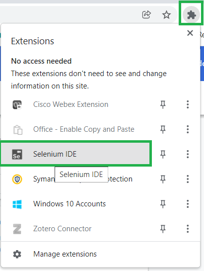
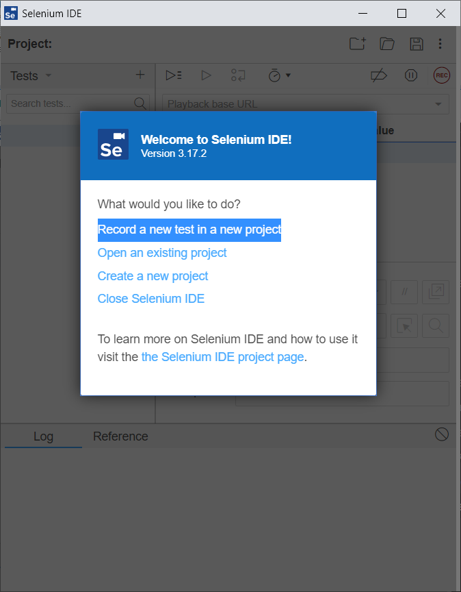
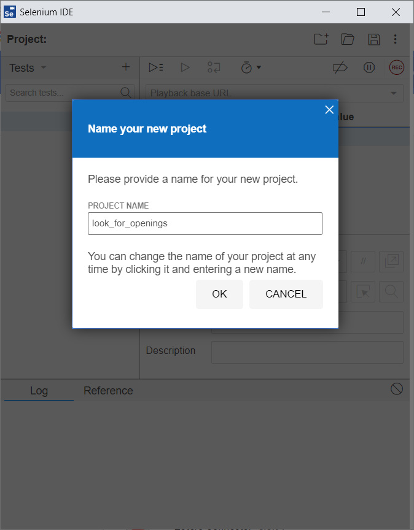
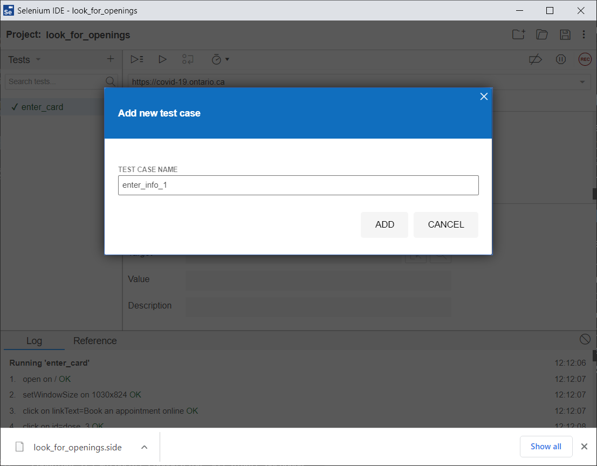

# Selenium

From: https://www.browserstack.com/guide/record-and-playback-in-selenium

## prerequisites
+ Chrome browser

## Installation
+ Install Selenium extension from chrome web store
https://chrome.google.com/webstore/detail/selenium-ide/mooikfkahbdckldjjndioackbalphokd
+ Relaunch Chrome

## Make a Selenium project
+ Open the Selenium extension in Chrome

+ Record a new test in a new project

+ Name your new project. Example: look_for_openings. Click ok.

+ Input the BASE URL. Example: https://covid-19.ontario.ca/
+ Input TEST CASE NAME. Example: enter_info_1

+ Click the red REC button to start recording.
+ Click Book and appointment on-line
+ Click _I want to book my_ :Booster dose of the vaccine
+ Enter postal code
+ Enter Green Ontario photo health card
+ Enter Day and Month of last vaccine
+ Answer: _Did you get a non-Health Canada authorized vaccine_
+ Enter _Birth year_
+ Click Get results
+ Click: A the provincial online booking system
+ Click: Book appointment
+ Click: checkbox: _I confirm that I read, understood, and accept the full Terms of use.
+ Click button: _Download your enhanced vaccine certifiate or book your vaccine appointment_
+ Enter: _Green health card number_
+ Enter: _2-letter version code_
+ Enter: _9-character code on the back of the health card_
+ Enter: _Date of birth_
+ Enter: _Postal code_
+ Click: _continue_
+ Save project

## Run tests
+ Click "play" button to Run current test